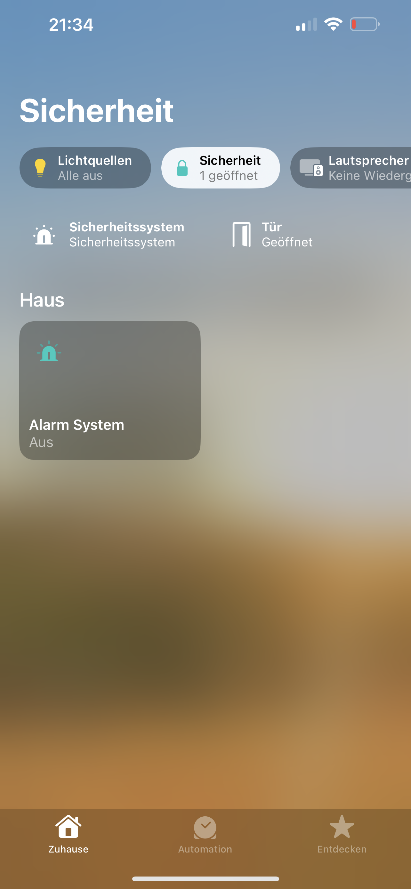
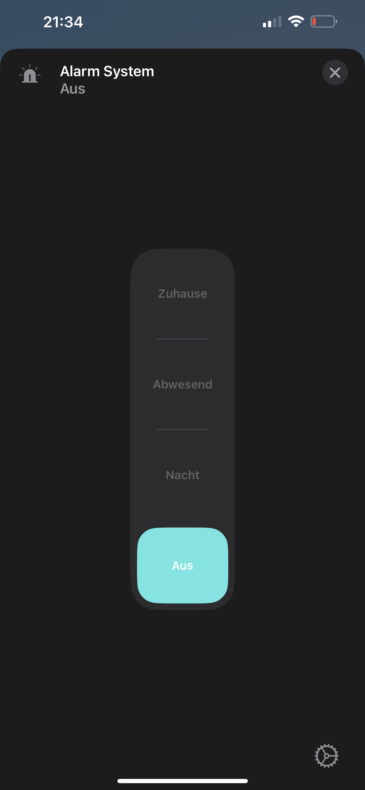

# Homebridge Lupus Security XT2

This is a homebridge plugin for the Lupus Security XT2 alarm system. _Example pictures are below._

## Functions

- See current status of the area 1 (home, armed, unarmed)
- See the current status of every sensor (open, closed) [only for contact sensors right now]
- Set the alarm status of area 1 to armed, unarmed, home 1

## Installation

1. Install homebridge using the official instructions.
2. Search for "homebridge-lupus-security" in the homebridge UI or install this plugin using: `npm install -g homebridge-lupus-security`.

#### Upgrade from 1.0.0 to 1.1.0
1. Upgrade the plugin via homebridge UI or `npm install -g homebridge-lupus-security`.
2. Remove the old accessory and other config values from the homebridge config.json or via the homebridge UI.
3. Set the new config values via the homebridge UI or add the new config values to the config.json.

## Configuration

1. Use the plugin configuration window to configure the plugin with the correct credentials.
2. Restart homebridge
3. Now you will have the Lupus Security XT2 alarm system as a HomeKit accessory.
4. The Lupus Sensors will be added automatically to HomeKit. You just have to add them via the "Add Devices" button in the Home app.

## Usage

    
    
     
    In the Home app overview, you can see the current status of the alarm system and the sensors.
     

You can change the status of the alarm system by clicking on the "Alarm" tile. You can choose between "Off", "Night", "Away" and "Home".

- Off: The alarm system is disarmed
- Night: The alarm system is armed in home mode 1.
- Away: The alarm system is fully armed.
- Home: The alarm system disarmed. <b>This will be changed in the future.</b>

## Troubleshooting
- If you got the error "Error while initializing the plugin.", you have to enter correct configuration values for the Lupus Security XT2 platform.
- If you got other errors, please open an issue on GitHub.

~~The plugin code is still very messy, but it works if everything is configured correctly. I will clean it up in the future.~~
 The plugin code now is very clean. :)
